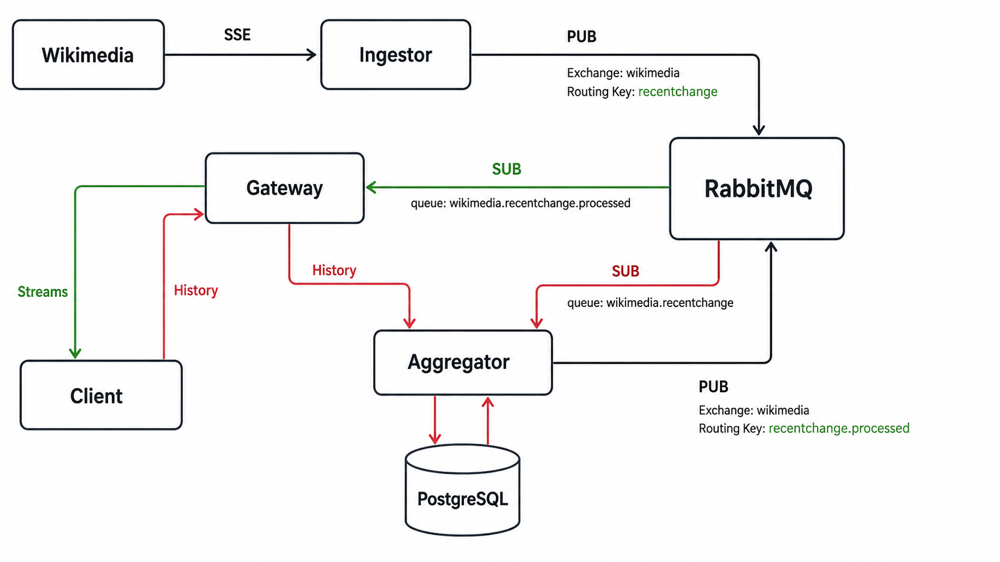

# Stream Pulse

StreamPulse is a real-time data processing platform built with a microservice architecture.

The project captures live public event streams, publishes raw events through a message broker, processes them with backend services, stores raw and aggregated data, caches hot state in Redis, and shows a live dashboard. The intended result is a system that visibly "pulses" under real load, with Grafana dashboards showing throughput, latency, and broker lag in real time.

The first supported source is the Wikimedia recent changes SSE stream:

```text
https://stream.wikimedia.org/v2/stream/recentchange
```

A second planned source is a public crypto WebSocket stream such as Binance or Coinbase. It will demonstrate the Bridge pattern by exposing multiple real-time sources through a single source interface.

## Target Stack

- NestJS microservices
- Kafka or RabbitMQ as the message broker
- PostgreSQL for relational aggregates and analytical queries
- MongoDB for raw event storage and ODM comparison
- Redis for hot aggregate caching
- React/Vite frontend
- Apollo Client cache
- Docker
- Kubernetes with minikube
- Helm
- Prometheus and Grafana
- Verdaccio as a private npm registry

## Architecture



The intended event flow is:

```text
Wikimedia SSE
  -> Ingester
  -> RabbitMQ
  -> Aggregator
  -> PostgreSQL + Redis hot cache
  -> RabbitMQ
  -> Gateway
  -> Client
```

Live processed events are delivered to clients through the gateway. Historical data is requested by the client through the gateway, resolved by the aggregator, and read from PostgreSQL.

## Services

### Ingester

The ingester captures external events and publishes raw messages to RabbitMQ.

Current behavior:

- Connects to the Wikimedia recent changes SSE stream.
- Parses SSE chunks safely.
- Publishes raw Wikimedia events to RabbitMQ.

RabbitMQ output:

```text
exchange: wikimedia
routing key: recentchange
queue: wikimedia.recentchange
```

### Aggregator

The aggregator processes raw Wikimedia events and stores queryable history.

Current behavior:

- Consumes raw events from `wikimedia.recentchange`.
- Normalizes events into processed Wikimedia change objects.
- Calculates tags, diff size, risk score, importance score, and project type.
- Persists processed events in PostgreSQL through TypeORM.
- Updates Redis activity windows, top Wikimedia pages, and recent event lists.
- Publishes processed events back to RabbitMQ.
- Exposes Prometheus application and runtime metrics at `GET /metrics`.

RabbitMQ output:

```text
exchange: wikimedia
routing key: recentchange.processed
queue: wikimedia.recentchange.processed
```

### Gateway

The gateway is the client-facing service.

Current behavior:

- Subscribe to processed event queues.
- Stream live updates to clients.
- Proxy history requests to the aggregator instead of reading PostgreSQL directly.
- Expose the Redis-backed dashboard snapshot at `GET /dashboard`.
- Apply a short browser cache policy to dashboard snapshots.

### PostgreSQL

PostgreSQL is planned as the durable history store for events, aggregates, and queryable state.

### MongoDB

MongoDB is planned as the raw event store.

Expected responsibilities:

- Store raw source events with minimal transformation.
- Provide an ODM-based persistence path for comparison with PostgreSQL ORM usage.
- Support analysis of ORM vs ODM tradeoffs on real project data.

### Redis

Redis is the hot cache layer owned by the aggregator.

Current cached data:

- Event and trade throughput for rolling one-minute and one-hour windows.
- Top five Wikimedia pages for the current UTC hour.
- The latest 100 processed Wikimedia events and Binance trades.

The aggregator updates these structures after PostgreSQL succeeds. Redis uses
bounded lists, expiring sorted sets, and a short deduplication key so redelivered
messages do not inflate the top-pages counter. If Redis is unavailable, durable
processing continues through PostgreSQL and RabbitMQ and `/dashboard` returns an
empty snapshot with `cacheAvailable: false`.

Configuration:

```text
REDIS_URL=redis://redis:6379
REDIS_CONNECT_TIMEOUT_MS=2000
```

### Frontend

The frontend is a React/Vite live dashboard.

Current behavior:

- Display live processed events from the gateway.
- Show historical and aggregated views.
- Poll `/dashboard` every five seconds for Redis-backed throughput and top pages.
- Seed and reconcile the live lists from the recent-event cache while retaining PostgreSQL history pagination.

### Observability

The aggregator has a complete local Prometheus and Grafana path.

Current behavior:

- Aggregator exposes `/metrics` in Prometheus format.
- Prometheus scrapes the aggregator every five seconds and retains data for seven days.
- Grafana automatically provisions the Prometheus datasource and the
  `StreamPulse Aggregator` dashboard.
- The dashboard shows throughput by source, processing and PostgreSQL p95
  latency, RabbitMQ ready-message lag, Redis availability and hit rate, and
  invalid/failed event rates.
- Node.js process metrics are exported with the `streampulse_aggregator_`
  prefix.

Application metrics:

```text
streampulse_aggregator_events_processed_total
streampulse_aggregator_event_processing_duration_seconds
streampulse_aggregator_persistence_duration_seconds
streampulse_aggregator_rabbitmq_queue_messages_ready
streampulse_aggregator_redis_cache_reads_total
streampulse_aggregator_redis_cache_writes_total
streampulse_aggregator_redis_cache_available
```

Metrics for the remaining services, alert rules, and Kubernetes probes remain
future observability work.

## Local Development

Requirements:

- Docker
- Docker Compose
- Node.js 22 for local service development

Start the current stack:

```bash
docker compose up --build
```

RabbitMQ Management UI:

```text
http://localhost:15672
username: guest
password: guest
```

The ingester service listens on:

```text
http://localhost:3000
```

The aggregator service listens on:

```text
http://localhost:3001
```

The gateway and frontend listen on:

```text
http://localhost:3002
http://localhost:5173
```

Redis is exposed locally on `localhost:6379`. To inspect the dashboard caches
while the stack is running:

```bash
curl http://localhost:3002/dashboard
docker compose exec redis redis-cli --scan --pattern 'streampulse:*'
```

Observability endpoints:

```text
Aggregator metrics: http://localhost:3001/metrics
Prometheus:         http://localhost:9090
Grafana:            http://localhost:3003
```

Grafana uses `admin` / `admin` for local development unless overridden:

```text
GRAFANA_ADMIN_USER
GRAFANA_ADMIN_PASSWORD
```

The Prometheus scrape configuration and provisioned Grafana dashboard are in
`observability/`.

## Current Repository Structure

```text
.
|-- AGENTS.md
|-- README.md
|-- diagram.png
|-- docker-compose.yml
|-- aggregator/
|-- frontend/
|-- gateway/
|-- observability/
`-- ingester/
```

Potential shared package area, once duplication justifies it:

```text
packages/
```

## RabbitMQ Concepts Used

Publishers send messages to exchanges. Consumers read messages from queues. Bindings connect exchanges to queues by routing key.

Current raw event route:

```text
Ingester
  -> exchange: wikimedia
  -> routing key: recentchange
  -> queue: wikimedia.recentchange
```

Current processed event route:

```text
Aggregator
  -> exchange: wikimedia
  -> routing key: recentchange.processed
  -> queue: wikimedia.recentchange.processed
  -> Gateway
```

## Development Commands

For any TypeScript service, run its scripts from the service directory:

```bash
npm run build
npm run lint
```

Run tests when test files exist:

```bash
npm test
```

Validate Docker Compose configuration:

```bash
docker compose config
```

## Project Notes

- The implemented services are `ingester`, `aggregator`, `gateway`, and `frontend`.
- RabbitMQ, PostgreSQL, Redis, and all implemented services are wired in `docker-compose.yml`.
- MongoDB raw storage, Kubernetes, Helm, Apollo Client, remaining-service metrics, and alerting remain roadmap work.
- Architecture guidance for future agents and contributors is documented in `AGENTS.md`.

## Roadmap

### Month 1: Data Stream, Broker, and Bridge (v0.1)

Goal: ingest real streams and pass them through a message broker.

Learning focus:

- Message brokers such as Kafka or RabbitMQ.
- Broker vs bus/service mesh.
- Bridge pattern for source abstraction.
- Monorepo, npm/yarn workspaces, and dependency caching.

Project work:

- Ingest Wikimedia EventStreams.
- Add a second source, a public crypto WebSocket such as Binance or Coinbase.
- Expose both sources through a single Bridge-style source interface.
- Publish source events to the broker.
- Add a consumer that stores raw events.

Done when:

- Two real-time sources work through one source interface.
- Events flow through the broker.
- The project can explain broker vs bus using its own architecture.

### Month 2: Storage, ORM/ODM, and Explain Plan (v0.2)

Goal: store and aggregate the stream, then understand query plans.

Learning focus:

- `EXPLAIN` and `EXPLAIN ANALYZE`.
- Indexes for time-series aggregations.
- Practical ORM vs ODM differences.

Project work:

- Store aggregates in PostgreSQL through an ORM.
- Store raw events in MongoDB through an ODM.
- Add heavy analytical queries.
- Prepare an EXPLAIN report with before/after measurements.

Done when:

- Aggregations work.
- The explain report contains real before/after numbers.
- ORM vs ODM is explained using project code and data.

### Month 3: Caching at All Levels (v0.3)

Goal: speed up the system with deliberate caching strategies.

Learning focus:

- Redis write-through, write-back, and cache-aside.
- Browser caching with `Cache-Control` and `ETag`.
- Apollo Client normalization and merge policies.

Project work:

- Add Redis cache for hot aggregates.
- Implement write-through and cache-aside where appropriate.
- Add correct HTTP cache headers.
- Build the frontend with Apollo Client normalized cache.

Done when:

- Cache hits are visible in metrics.
- The project demonstrates three cache strategies and explains when each fits.
- Apollo Client avoids unnecessary repeated requests.

### Month 4: Kubernetes and Helm (v0.4)

Goal: run the system in Kubernetes and make deployment reproducible.

Learning focus:

- Kubernetes abstractions: Pod, Deployment, Service, ConfigMap, Secret, and Ingress.
- Service discovery through Kubernetes DNS and Services.
- Helm charts.

Project work:

- Deploy all services to minikube.
- Add a Helm chart for the whole application.
- Make services communicate through Kubernetes Services.
- Move runtime configuration into ConfigMaps and Secrets.

Done when:

- `helm install` starts the whole stack in minikube.
- Services communicate through service discovery.
- Services can scale through replicas.

### Month 5: Observability with Prometheus and Grafana (v0.5)

Goal: make the system fully observable.

Learning focus:

- Prometheus metrics and PromQL.
- Grafana dashboards.
- Alerting.
- Health, readiness, and liveness probes.

Project work:

- Add `/metrics` to every service.
- Configure Prometheus scraping.
- Build Grafana dashboards for throughput, p95 latency, broker lag, and cache hit rate.
- Add alerts for high latency and broker lag.
- Add readiness and liveness probes in Kubernetes.

Done when:

- Live dashboards show the system in real time.
- Alerts fire under simulated load.
- Kubernetes probes are configured for all services.
